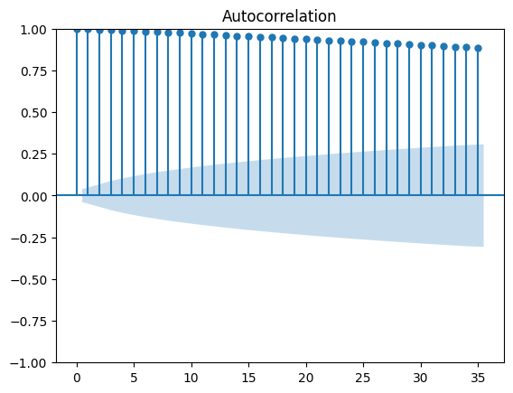
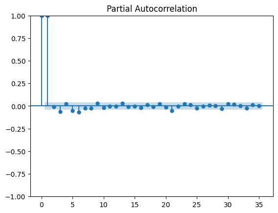
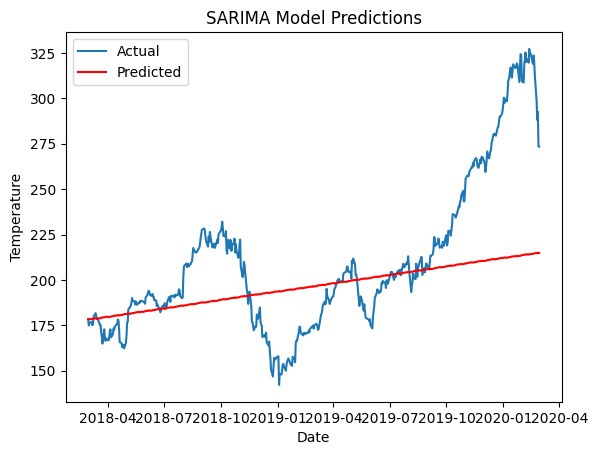

# Exp.no: 10   IMPLEMENTATION OF SARIMA MODEL
### Date: 22/05/2026

### AIM:
To implement SARIMA model using python.
### ALGORITHM:
1. Explore the dataset
2. Check for stationarity of time series
3. Determine SARIMA models parameters p, q
4. Fit the SARIMA model
5. Make time series predictions and Auto-fit the SARIMA model
6. Evaluate model predictions
### PROGRAM:
```
import pandas as pd
import numpy as np
import matplotlib.pyplot as plt
from statsmodels.tsa.stattools import adfuller
from statsmodels.graphics.tsaplots import plot_acf, plot_pacf
from statsmodels.tsa.statespace.sarimax import SARIMAX
from sklearn.metrics import mean_squared_error

df = pd.read_csv('Apple_Stock.csv')
df.head()

df.drop([' Volume', ' Open', ' High', ' Low'], axis=1, inplace=True)
df.head()

df.columns = df.columns.str.strip()
df.columns

df['Close/Last'] = df['Close/Last'].replace('[\$,]', '', regex=True).astype(float)

df['Date'] = pd.to_datetime(df['Date'])
df = df.sort_values(by='Date')
df.set_index('Date', inplace=True)

plt.plot(df.index, df['Close/Last'])
plt.xlabel('Date')
plt.ylabel('Rate')
plt.title('Price history of Apple Stock')
plt.show()

def check_stationarity(timeseries):
    result = adfuller(timeseries)
    print('ADF Statistic:', result[0])
    print('p-value:', result[1])
    print('Critical Values:')
    for key, value in result[4].items():
        print('\t{}: {}'.format(key, value))

check_stationarity(df['Close/Last'])

plot_acf(df['Close/Last'])
plt.show()

plot_pacf(df['Close/Last'])
plt.show()

sarima_model = SARIMAX(df['Close/Last'], order=(1, 1, 1), seasonal_order=(1, 1, 1, 12))
sarima_result = sarima_model.fit()

train_size = int(len(df) * 0.8)
train, test = df['Close/Last'][:train_size], df['Close/Last'][train_size:]

sarima_model = SARIMAX(train, order=(1, 1, 1), seasonal_order=(1, 1, 1, 12))
sarima_result = sarima_model.fit()

predictions = sarima_result.predict(start=len(train), end=len(train) + len(test)-1)
mse = mean_squared_error(test, predictions)
rmse = np.sqrt(mse)
print('RMSE:', rmse)

plt.plot(test.index, test, label='Actual')
plt.plot(test.index, predictions, color='red', label='Predicted')
plt.xlabel('Date')
plt.ylabel('Temperature')
plt.title('SARIMA Model Predictions')
plt.legend()
plt.show()
```
### OUTPUT:





### RESULT:
Thus the program run successfully based on the SARIMA model.
